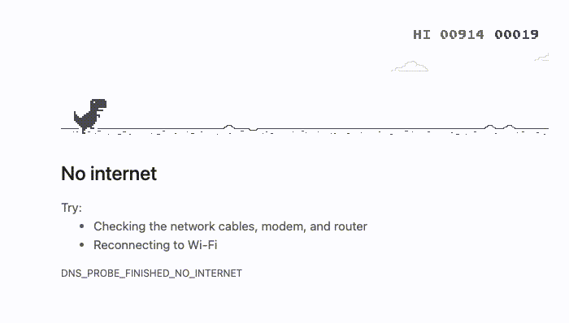
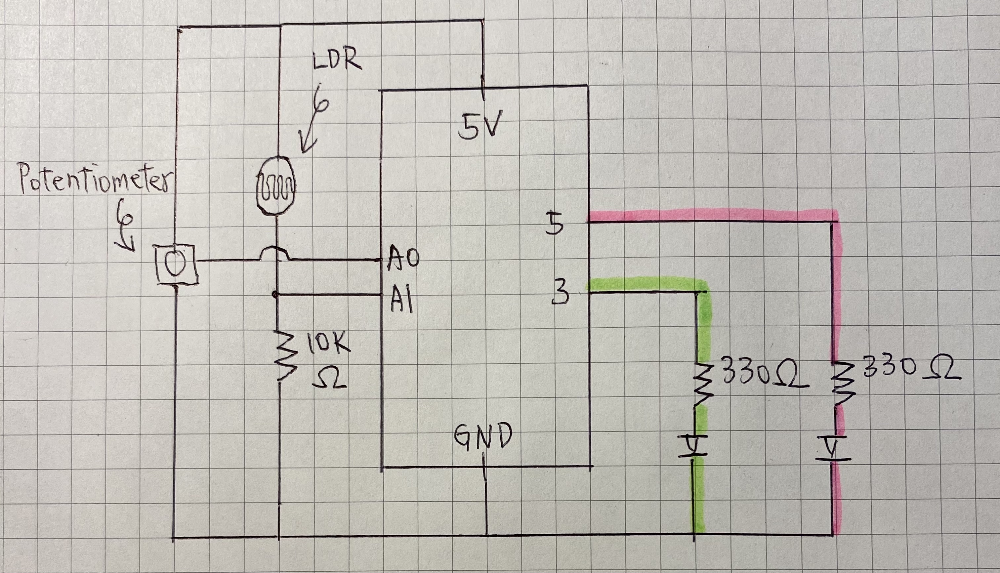
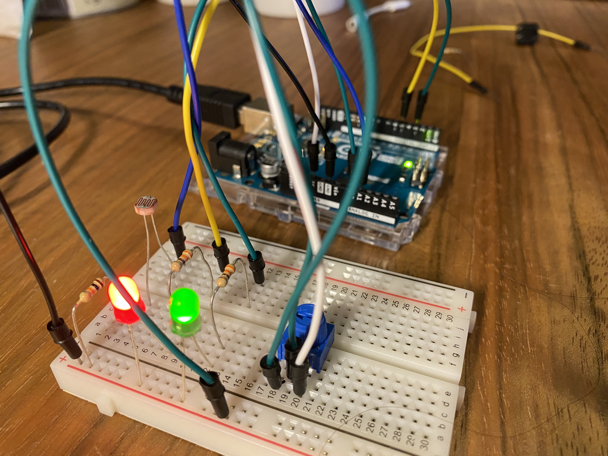
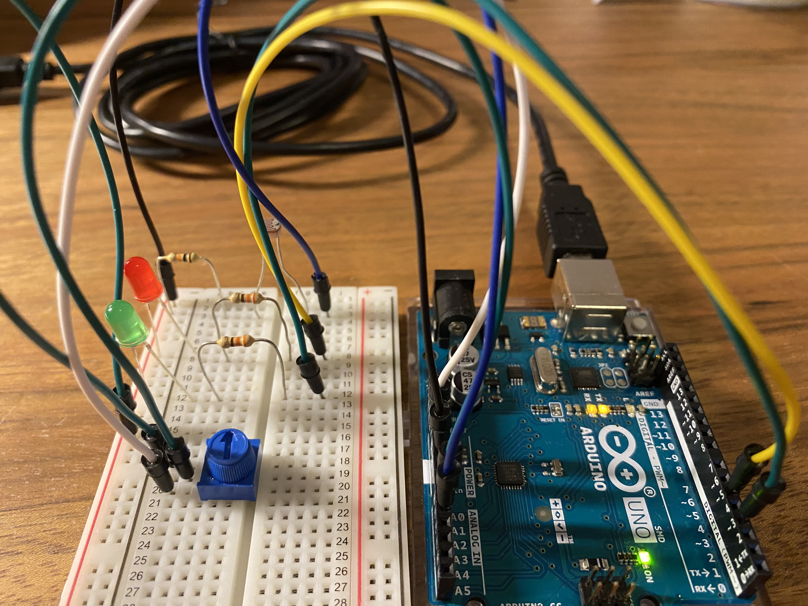
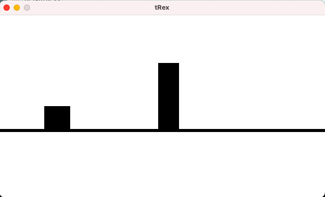
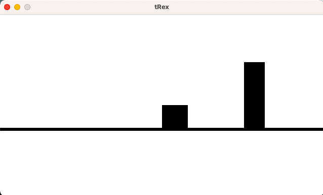

# Game with ARDUINO and Processing: Google's T-Rex

For this week's assignment, we should create a game that includes Processing program and ARDUINO program. 
I am inspired by the T-Rex game when Google crashed and decided to work on that. 

  

## Description 
The game's color theme is black and white. The t-rex is the black square in the middle of the screen that runs on the track. I planned to let the player control the t-rex's movement (move left and right) by turning the potentiometer. Moreover, the player can make the t-rex jump by touching the light sensor. The program will include an obstacle in which if the t-rex touches it , the screen will display "GAME OVER" meaning the player fails to let the t-rex avoid the obstacle. Not only so, the mousePressed function will turn on the lights on the bread board and simultaneously make the t-rex invisible. With this tip, the player may let the t-rex avoid the obstacle by making it invisible. 

## Schematic

  

## ARDUINO

  
  

  

## Demo

Loosing the game

Winning the game

## Difficulties and Discoveries
1. I was trying to write a program using Class that allows me to add new obstacles. I had two functions under the Class Obstacle "void show and void move". However, when I put obstacle.move and obstacle, show at the void setup section, the two functions are not working. The error message was syntax error: "missing operate or semicolon". i shall figure out why. 
2. I had tried to use digitalRead the button and write a function for which the t-rex will jump whenever the button is pressed. However, if I do that, the t-rex will remain in the air after jump and not return back to the ground. I had tried using if statement saying if the buttonState == 0, then t-rex should be at the ground. However, I discovered that the buttonState will sometimes be "1" even when I was not pressing the button. Therefore, I settle with using analogRead LDR as the way to control t-rex's yPos. This is not ideal because the light sensor value is unstable. 
3. There were bugs in the Game Over function, but I guess I obtained the minimal viable product. 

