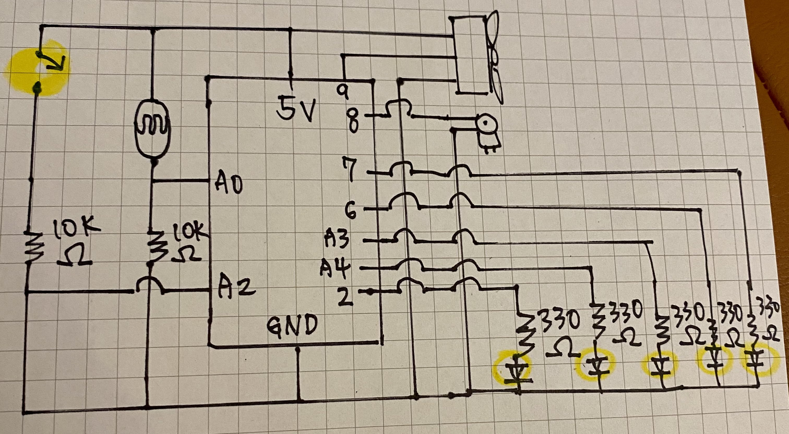
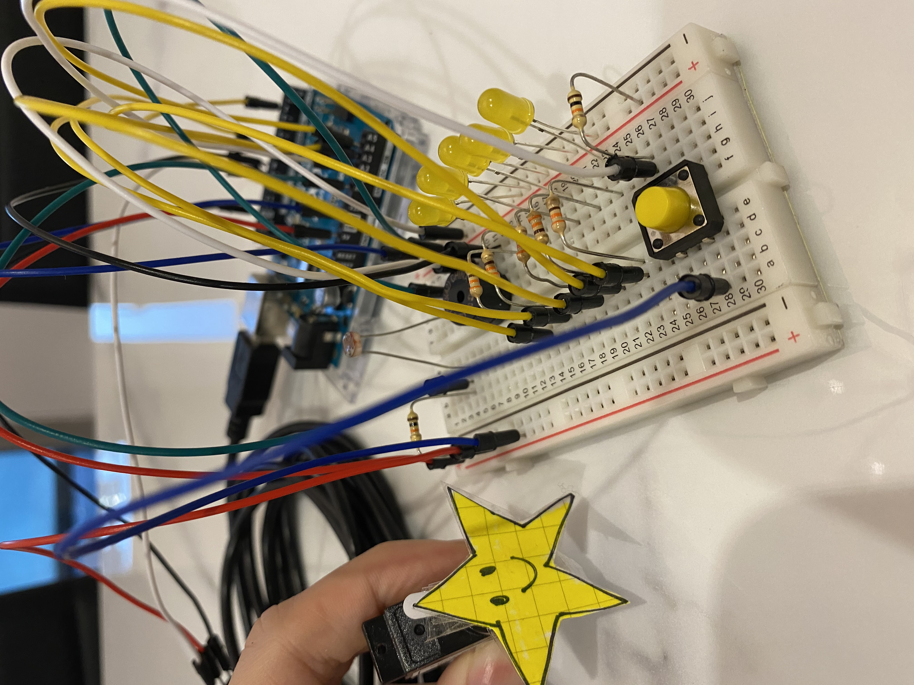
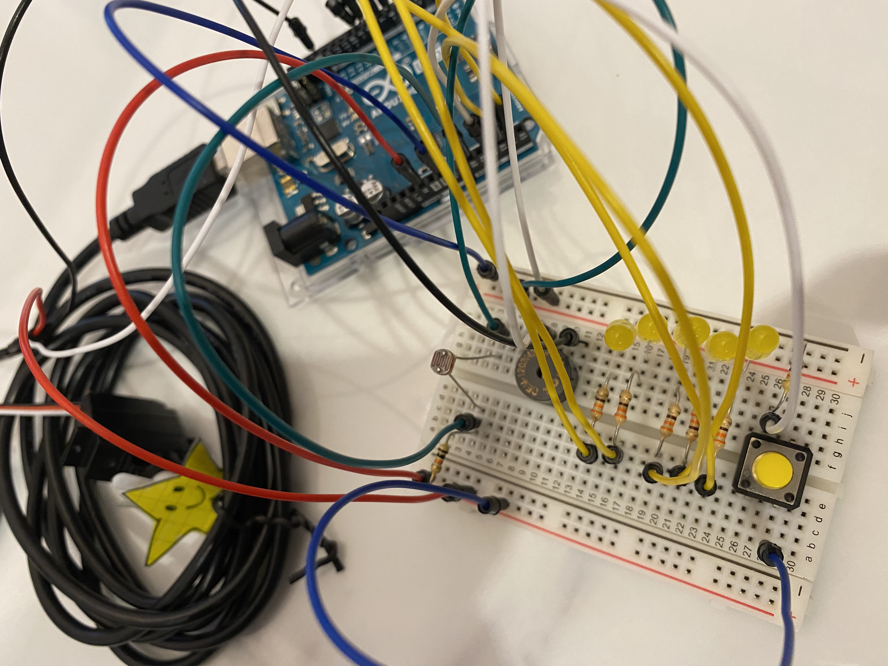

# Musical Instrament

For this assignment, we are instructed to create a musical instrument with the ARDUINO board, using analog and digital functions. We should also add the new learned server motor and the speaker. 

## Ideation 
I first list out the elements I have on hand: switches, LED light, server motor, light sensor, and the speaker. Then, I thought of the elements may altogether perform "Twinkle twinkle little start". The speaker will play the melody of the song "Little Star". The server motor will run a full circle when the switch is pressed. The switch is pressed at the pauses during the song. This part is operating upon the digital fashion. On the other hand, the light sensor is controlling the LEDs. When the light sensor detects darkness, the LEDs' pattern will change. This part is operating upon the analog fashion. 

## Schematic
After I have a basic idea, I prepare the materials: two yellow light bulbs, one yellow switch, the light sensor, the sever motor, and the speaker. 

  

## Process

  

## Final Demo

## Difficulties: 
For some reasons can not explain, the switch and the light sensor's program are not working as intended. I will spend more time scrutinize the problem 

1. Unable to allow the server motor and the speaker to operate at the same time. 
2. Took hours to figure out how to let the server motor produce the desirable pattern but still failed to do so. 
3. At one point, my LEDs are not working at all. Weirdly, I made the circuit and wrote the code just like how we did in class. Then, I discovered something interesting. There are three GNDs on the board (one on the side and two on the other). I discovered that when one of the two wires of the speaker, that is suppose to be connected to GND, is directly connected to one of the three GND pins on the ARDUINO board, the LED will not flash according to the speaker, but would just be bright all the time. However, when I use a wire to connect the GND pin on the ARDUINO board to the bread board, allowing the LEDs have connection to the GND pin via the bus, the LEDs will flash according to the melody. Though these hardware operations are not what I was looking for as I need to control the LED via the written program, it is an interesting/WEIRD discovery. 

