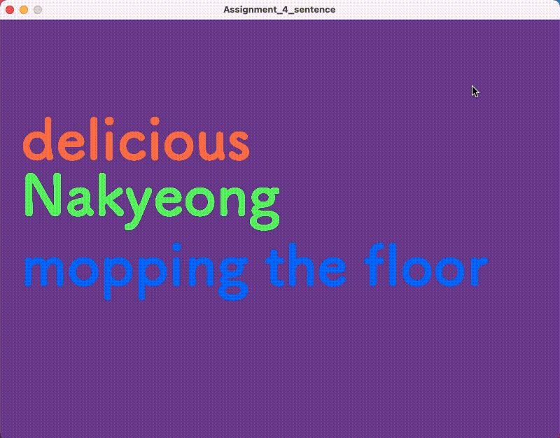

## Assignment 4: Generative Text: Sentence 

For this assignment, I decided to create a coumputer-generating statement, consisting of adjective in red, noun(name) in green, and verb in blue.
I was inspired by the childhood game of mixing words to create sentences and glad able to do this again, interestingly not on paper, but with computer. I created my data with Google sheet and downloaded them as .csv files. The noun here are people from this IM class, as I thought this project may have some entertaining effect. Following is the final work:

## Description

## Process

## Difficulty

## Discovery 
