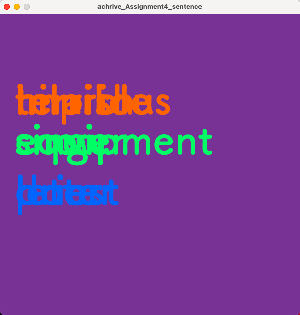

## Assignment 4: Generative Text: Sentence 

## Description
For this assignment, I decided to create a coumputer-generating statement, consisting of adjective in red, noun(name) in green, and verb in blue.
I was inspired by the childhood game of mixing differet types of words to create sentences and glad able to do this again, interestingly, not on paper, but with computer. I created my data with Google sheet and downloaded them as .csv files. The nouns here are people from this IM class, for the sake to give this project some entertaining effect. The background color is the NYUAD purple. 

Following is the final work:


## Process
I initially imported .csv files of lists of adjective, verbs, and noun from the internet. Then, I concluded that those complicated words adding together might not be too interesting, so I created my own data via Google sheet, and downloaded the sheets as .csv file. The process was easier than I thought.


Then, I created arrays for .csv files and the text data. Also, I deteremined some basic properties such as x and y values. Next, I wrote the program that loads the .csv files of each type of words: adjective, noun, and verb to the sketch. Follow that was the display function, which is the backbone of the program, displaying the text. Finally, the mouseClicked program was used to ensure that the sketch generates a new sentence whenever I click the canvas. 

## Difficulty
### First problem:
I found it challenging to make the function of *randomly choosing index* and the function of *click to start a new page and new sentence* compatible with each other. If I want to let the former work, then different names for the index of adjective, noun, and verb is required, but if wanting to let the latter "start new page" function work, the mouseClicked function needs command having only one name for the index. 

The following are the codes under the display function(the tried version, not included in the final .pde). Notice how the following includes indexA for adjective, infexN for noun, and indexV for verb. The different naming for index successfully let the program randomly choose a word from the list to display.
```
  color adjectiveColor = color (255, 100, 0);
  fill(adjectiveColor);
  int indexA = int(random(adjective.length)); 
  text(adjective[indexA],x,y);
  //noun
  color nounColor = color (0, 255, 100);
  fill(nounColor);
  int indexN = int(random(noun.length));  
  text(noun[indexN],x,y+80);
  //verb
  color verbColor = color (0, 100, 255);    
  fill(verbColor);
  int indexV = int(random(verb.length));  
  text(verb[indexV],x,y+180);
```
After writing the display function, I wrote the mouseClicked function including the following command for changing the sentence.  
```
index =index+1;
```
However, rather than displaying list of words consecutively, I intended it to randomly pick the words, but I have not yet find a way to do that effectively.

### Second problem:
I was trying to solve the problem of having the sentences overlapping after clicking by finding ways to erase the already displayed sentences. This problem is realted to playing around the mouseClicked function as trying to find a solutoin for the above problem. Laster on, I managed to solve it by having the program adding new blank purple rectangle size same as the canvas during every new click.



## Discovery 
1. This might not be a discovery, but I think knowing which function requires float and which requires int is imporant, because that mistake got me stuck for a multiple times.  
2. In occasions I thought I should use noLoop(); and loop(); may sometimes turn out to be unessesary. 
3. println function shows text at the console, and text function deiplays text at the screen.
4. .length is about the length of the array/list of data and not the actual length.
5. https://cloudconvert.com/mov-to-gif Cloudconvert is a pretty user friendly website in converting .mov to .gif, but need to sign up.
6. Curious about what the statment "ArrayIndexOutOfBoundsException: Index 17 out of bounds for length 17" that showed up at the console means.
