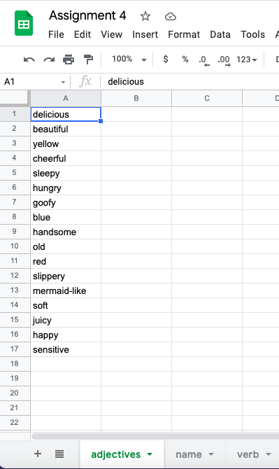

## Assignment 4: Generative Text: Sentence 

## Description
For this assignment, I decided to create a coumputer-generating statement, consisting of adjective in red, noun(name) in green, and verb in blue.
I was inspired by the childhood game of mixing differet types of words to create sentences and glad able to do this again, interestingly, not on paper, but with computer. I created my data with Google sheet and downloaded them as .csv files. The noun here are people from this IM class, as I thought this project may have some entertaining effect. The background color is the NYUAD purple. Following is the final work:

## Process
I initially imported .csv files of lists of adjective, verbs, and noun from the internet. Then, I concluded that those complicated words adding together might not be too interesting, so I created my own data via Google sheet, and downloaded the sheets as .csv file. The process was easier than I thought.

Then, I created arrays for .csv files and the text data. Also, I deteremined some basic properties such as x and y values. Next, I wrote the program that loads the .csv files of each type of words: adjective, noun, and verb to the sketch. Follow that was the display function, which is the backbone of the program, displaying the text. Finally, the mouseClicked program was used to ensure that the sketch generates a new sentence whenever I click the canvas. 

## Difficulty

## Discovery 
