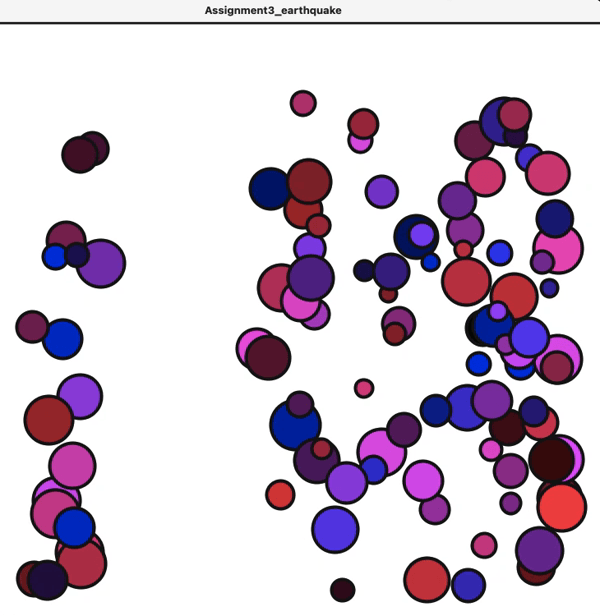

## 3rd Assignment_OOP: Earthquake

The circles are the students' head. The choice of color(red and purple) reveals that the people are anixous.

The left group is shaking and the others are panicing. 

## Description

For this assignment, I created an artwork that conveys the sense of urgency during earthquake. I got the inspiration from recent 2 huge earthquakes happened in Taiwan. In addition, Dan's video and the short assignment we did at the end of the last class also helped me a lot in understanding the concept of object oriented programming. Overall, the artwork is a macro view of people's reaction to the earthquake from the ceiling. The confinement of Processing allows this piece to present a suffocating sense. 

## Process

In terms of the programming process, I applied what I have learned, which is first determine the class, then insert the functions the object under the class should execute, and finally, run the program. 
In terms of the process of doing this assignment, it was a lot more daunting than I thought. I spent a lot of time understanding how object oriented programming really works before start coding. 

## Difficulty 

1. I found it challenging to accustomed to the new order of the functions. Before learning how to do object-oriented programming, the void setup() and draw() function is put at the beginning of the program. Now, with object-oriented programming, those functions are put at last.  
2. I was unable to create certain interesting functions due to limited ability. The process of exploring new tools is fun, but learning it and merging it into the code, especially to the object oriented program, is tricky. 

## Discovery 
1. Remember the order/layer of curly brackets help minimize coding mistakes. 
2. We don't always need to active functions via the functions Processing defined [such as draw() ] If incorporating an invented function under a previous invented function, we may also active that function.

