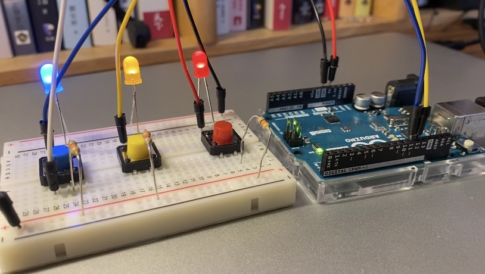

# Arduino UNO 1st Assignment: Who are the Dancing Friends? 

## Demo 

## The Puzzle: 
For the 1st assignment, I choose to create a puzzle for which the participant will have to guess which two lights are "dancing friends" by pressing the three buttons. The colors of the lights and the buttons are correspondent to each other. 

## Schematic 

## Process
I first spend time to go over the class materials, mainly understanding how the schematic matches the Arduino board. Then, I started experimenting how the different light positions may create different effects. Finally, I construct the puzzle I have in mind. 

## Challenges
It took me a LONG while to understand the relationship between different elements of the Arduino kit. While the Processing foundation developed from previous classes were helpful, I still was confused about how to incorporate the knowledge of creating visual artwork or games to making the buttons and lights on the board present meaningful interactions. 

## Discoveries (more like notes)
1. The brightness of the light when using the 10 resistence is smaller than using the 330 resistence. 
2. The electricity flow is from left to right, and flow in the vertical direction on the board. 
3. Does not matter having the resistence before or after the light bulb.
4. Some circuits may be unnecessary. 

