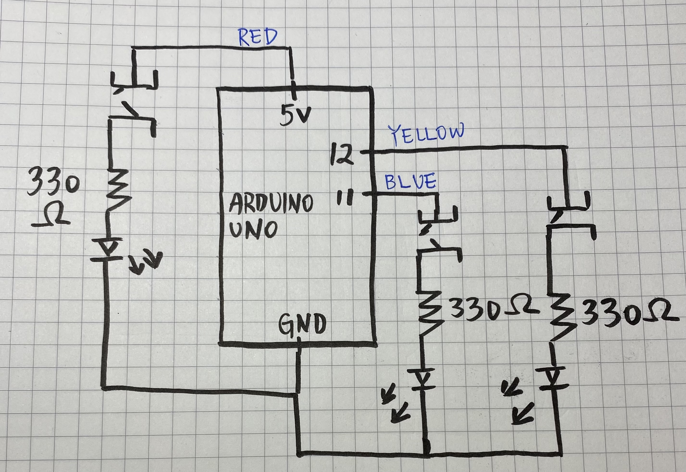

# Arduino UNO 1st Assignment: Who are the Dancing Friends? 

## Demo 

## The Puzzle
For the 1st assignment, we are asked to include at least three buttons and three lights on the Arduino, and write a function that allows the buttons and the lights to interact/shine in a way that the participant can play with it as a puzzle. 

## How to engage? (Preface)
For my project, I have three buttons(red, yellow, and blue), and three buttons with colors correspondent to the lights. I invite the participants to see the three light bulbs as friends. However, two light bulbs are particularly best friendds. They are holding hands, jumping up and down in the way that one would be in the air while the other is on the floor. To guess which two (red with yellow, red with blue, yellow with blue) are the best friends, try pressing the buttons and see which combination works! 

## Schematic 

## Process
I first spend time to go over the class materials, mainly understanding how the schematic matches the Arduino board. Then, I started experimenting how the different light positions may create different effects. Finally, I construct the puzzle I have in mind. I enhanced the difficulty of the puzzle the "Dancing Friend" by allowing them all to be flashing according to the light on the Arduino board by default. When buttons are pressed, the lightness of  the light bulbs connected to the particular buttons will enhanced. The design is to trick the participants' eyes and have them to be careful with their observations. 

## Challenges
It took me a LONG while to understand the relationship between different elements of the Arduino kit. While the Processing foundation developed from previous classes is helpful, I still was confused about incorporating the knowledge of creating visual artwork or games to make the buttons and lights on the board present meaningful interactions. I did not understand to what extent are the functions from Processing applicable to Arduino. Also, I repeatedly restart the assignment because it was easy for me to get lost when adding too many things to the board. Nevertheless, I have learned a lot from this assignment and catch up on the lecture information. 

## Discoveries (more like notes)
1. The brightness of the light when using the 10 resistence is smaller than using the 330 resistence. 
2. The electricity flow is from left to right, and flow in the vertical direction on the board. 
3. Does not matter having the resistence before or after the light bulb.
4. Some circuits may be unnecessary. 

