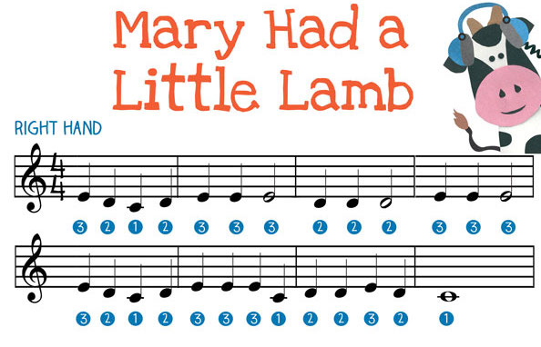
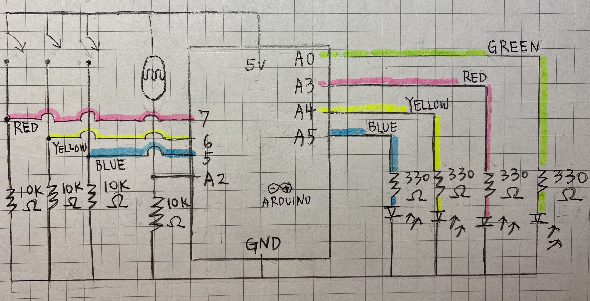
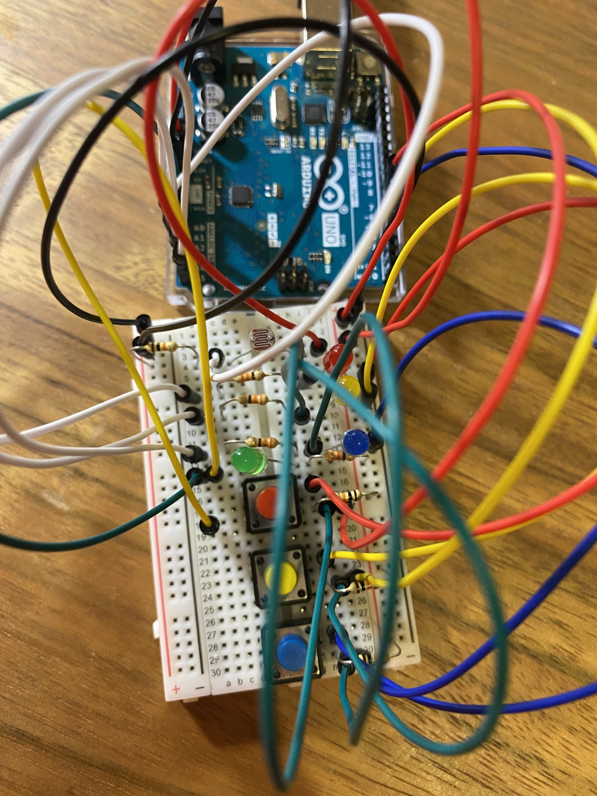
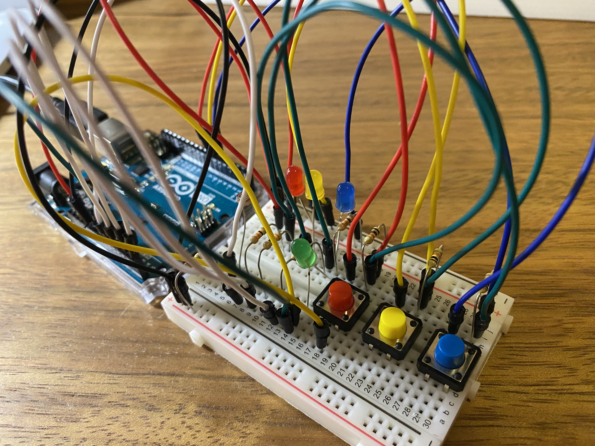
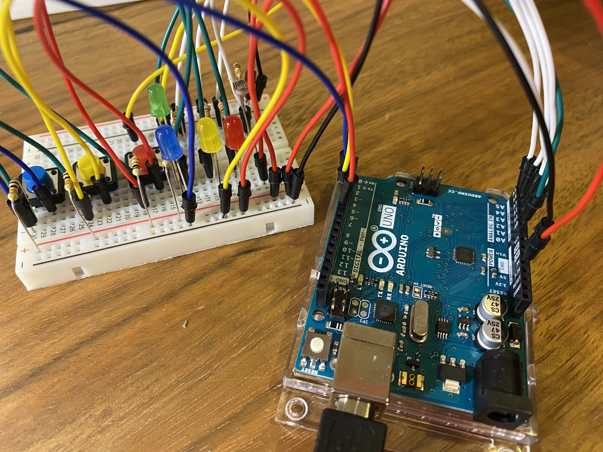
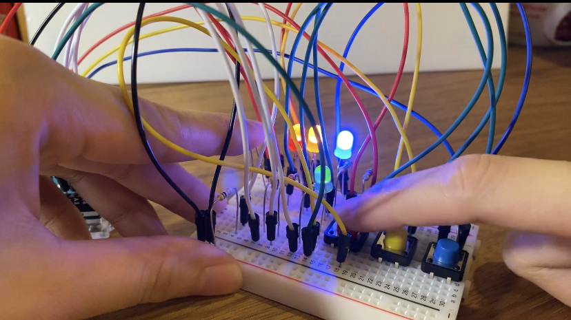
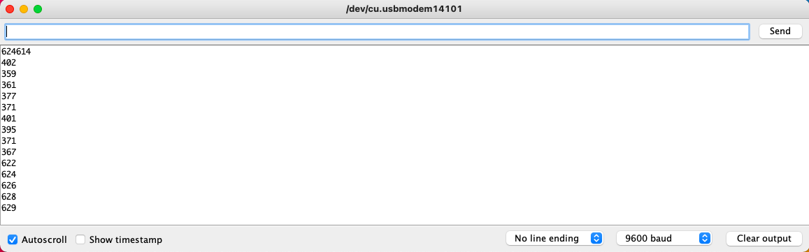

# AUDUINO 2nd Assignment: Marry had a Little Lamb

## Ideation 
For this week's assignment, we are instructed to use at least one analog sensor (eg: light sensor) and at least one digital sensor (eg: switch), and use their information to control at least 2 LED lights in a creative way. First, I thought of applying the light sensor. Then, I came up with an idea to have the participants to interact with the Arduino board as if it is some sort of musical instrument. The song that I picked was the song with three notes: Marry had a Little Lamb. The light sensor is applied when the participants want to do a slower version of the song. 

  

## Process
After I have an idea, I decide on the elements I need from Arduino: 3 light bulbs, 3 buttons, and 1 light sensor. Then, I draw the schematic. 

  

After I draw the schematics, I started working on the Arduino. 

  
  

  

  

After I completed the Arduino, I worked on writing the code. 

#Final Demo

## Difficulties
Initially, I wanted to have pressing blue button for three times signify the song begins. However, I am unsure about how to write a code for that. Since we have learned: if (blueButton == HIGH) { digitalWrite (LED, HIGH) } Therefore, to have something happen after button being pressed for 3 times, we need code that does something like: if (blueButton == HIGH  and blueButton == LOW and blueButton == HIGH and blueButton == LOW and blueButton == HIGH and blueButton == LOW) {then the game starts}. This whole idea can not completely fit in the if statement. Or, it'll take too long for me to figure out, therefore, the design turned out to be a more flexible version. 

On the other hand, I notice that the speed of changing the brightness is not obvious with or without the light sensor. However, there indeed was a change in the sensor value: 

  

## Discoveries
There was one point that my code would not work with digitalWrite until it changed to analogWrite, which is interesting. 
