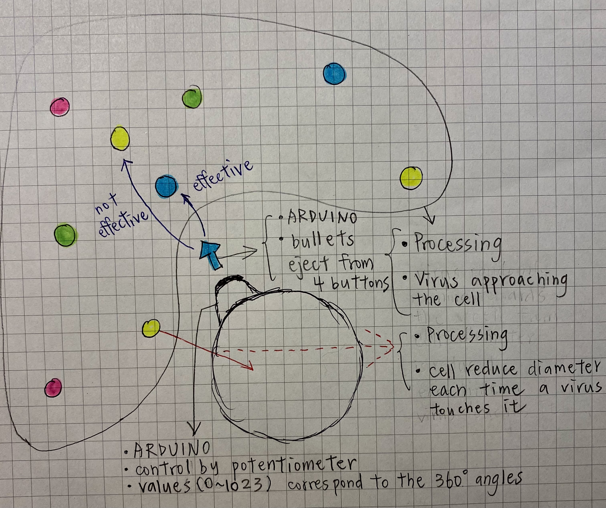

# Final Project: Fighting the virus 

## Concept
1. Touch potentiometer (ARDUINO) : The cell changes its angle so to aim the virus. sensorValue 0-3 means 1 degree, sensorValue 3-6 means 2 degree, and so on. 
2. Press buttons (ARDUINO) : Create arrow-shape bullets that are ejected from the cell. The color of the bullets depends on the color of the button pressed. 
3. Virus appraoch the cell (PROCESSING) : When game start, virus of colors blue/green/red/yellow appraoche the cell. 
4. Virus and bullet of the same color collides (PROCESSING) : Both disappear. 
5. Virus and bullet of different color collides (PROCESSING) : Virus continue appraoches the cell. 
6. Virus touches the cell (PROCESSING) : cell's diameter -2 
7. How to win ? Cell remains after 100 virus appraoched it. 
8. When is losing ? Cell diameter <= 5 after 100 virus. 
9. >> LED becomes red if the cell is about to die if five more virus hits it. 

  

## Questions 
1. How to make the virus vanish from the screen whenever it touches the cell? 
2. How to make the bullets and virus both vanish together when they collide? 

