# Final Project: Fighting COVID 

  

COVID has been a huge part of our lives now, whether or not we like it. Therefore, I have decided to create a project allowing us to engage in the process of fighting  this one of the most catastrophic global pandemic in the history. 
 
## Background:

  

  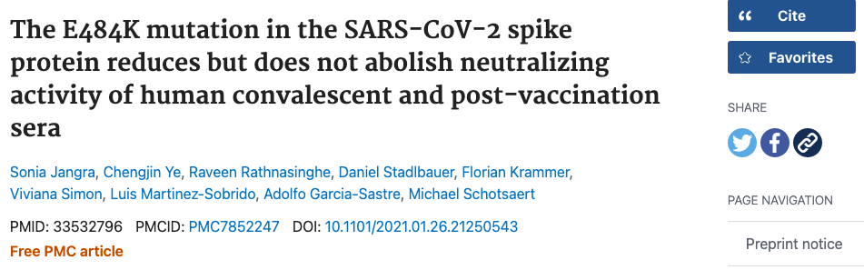

  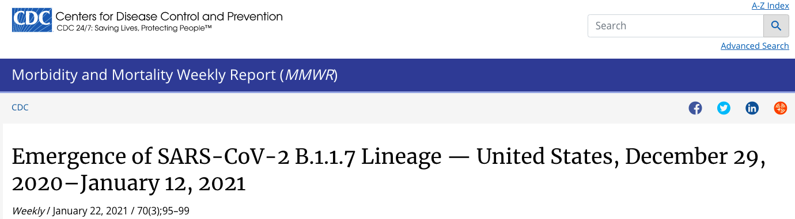

Moderna and Pfizer are the two types of vaccines that we can get to prevent COVID. As more people are taking those vaccines, we started to discover dangerous side effect including rare blood disorder. Moreover, as the virus gradually have more mutations such as E484K and B117 the vaccines effectiveness started to decrease. Therefore, more medical companies, including Moderna and Pfizer, are suggesting the need to take a third shot. 

## Instructions

This game will have four objects in total that fall from above: Moderna vaccine, Pfizer vaccine, B117 variant virus, and E484K variant virus. At the bottom, there is a purple cartoon that signifies your cell. To win the game, have the cell consumed 3 Moderna shots and 3 Pfizer shots. Careful in the situation where the cell has 3 Moderna shots but not yet obtained 3 Pfizer shots. In this case, if the cell is hit by B117 variant (the red virus),the accumulated Moderna shots will decreased by 3. This rule applies to Pfizer shot and its relationship to the E48EK variant. 

### Screen 1

  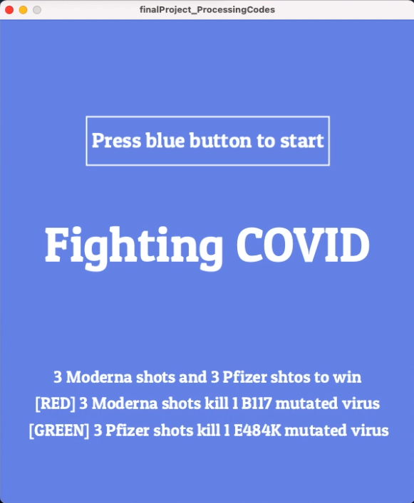
The first screen is the start screen that display rules. The player has to press the blue button to start the game. 

  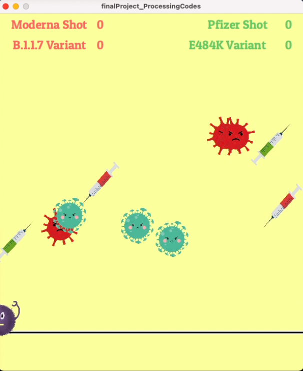
Game begins. Take note that both Moderna shot and B117 variant have the red aesthetic to specify the rule of a hit by the variant B117 will lead to a loss of 3 Moderna shots. The same rule applies to Pfizer and E484K, which are depicted in green. 

  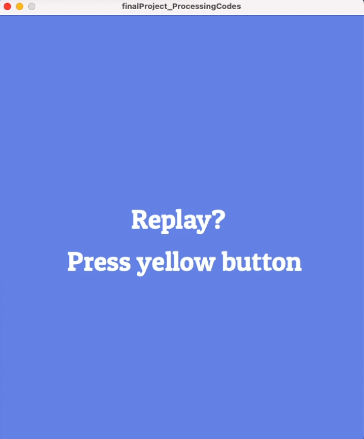
If you unfortunately hit by the cell and had not enough shots to fight back (3), then you lost. Press the yellow button to replay. 

  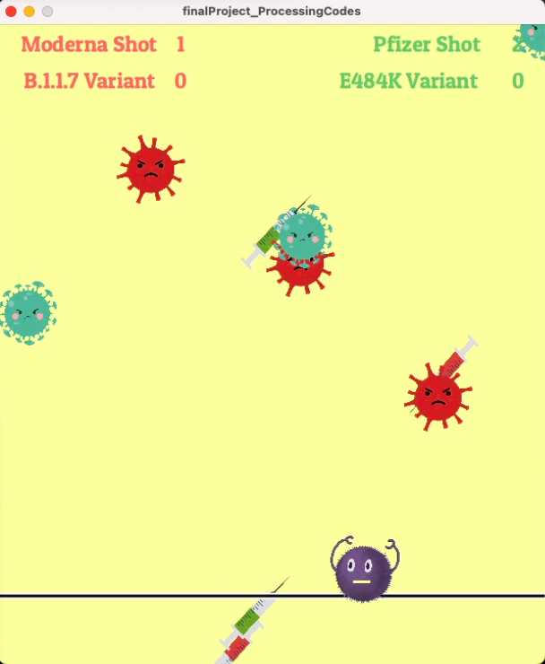
Another thing to note about playing Fighting COVID is that you can press the red button to move the B117/red virus existed on the screen to collectedly move to the left. The same logic applies to green button and moving the E48EK/green virus. 

  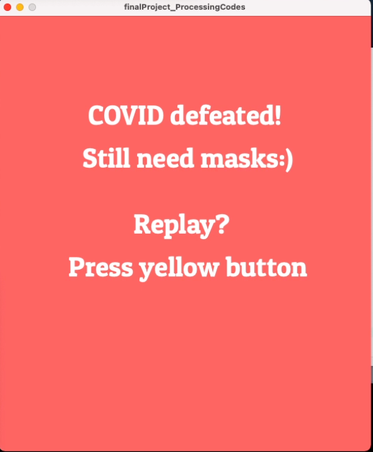
Congratulations to win the game by having enough vaccines. Hope you well in fight COVID in real life too. 

## Schematic 

  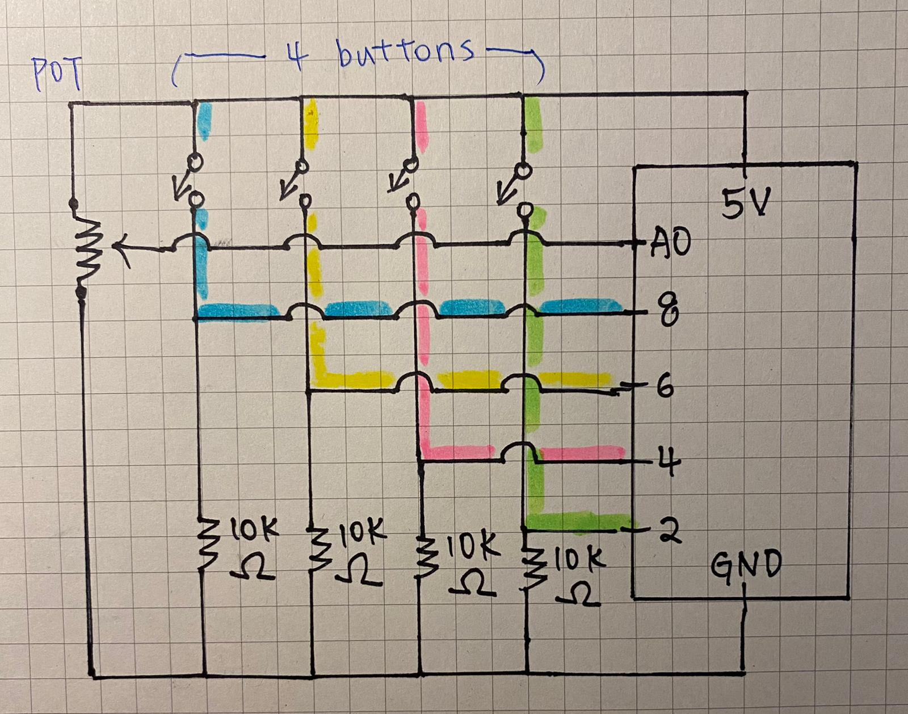

## Progress 

  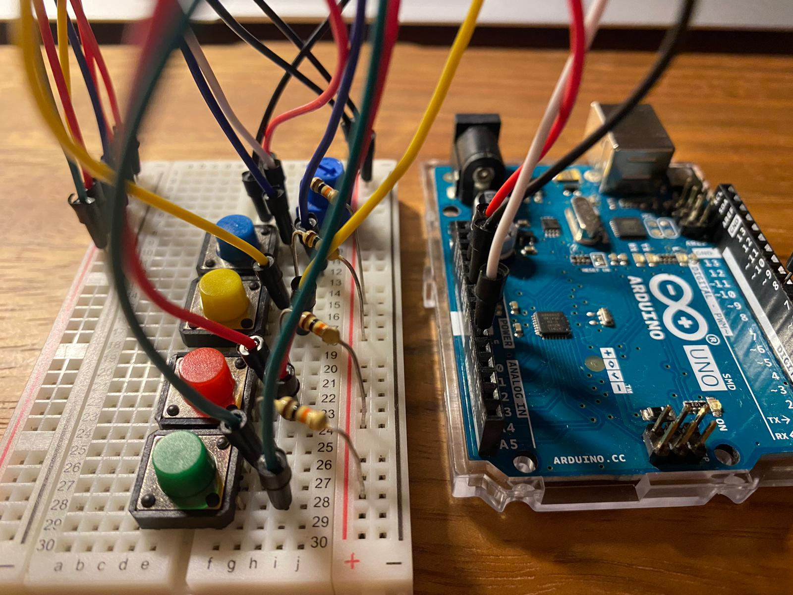

  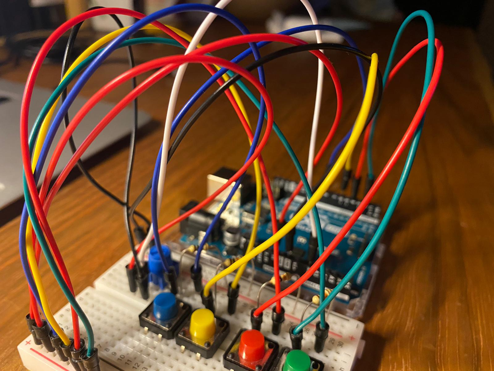

## Demo 

[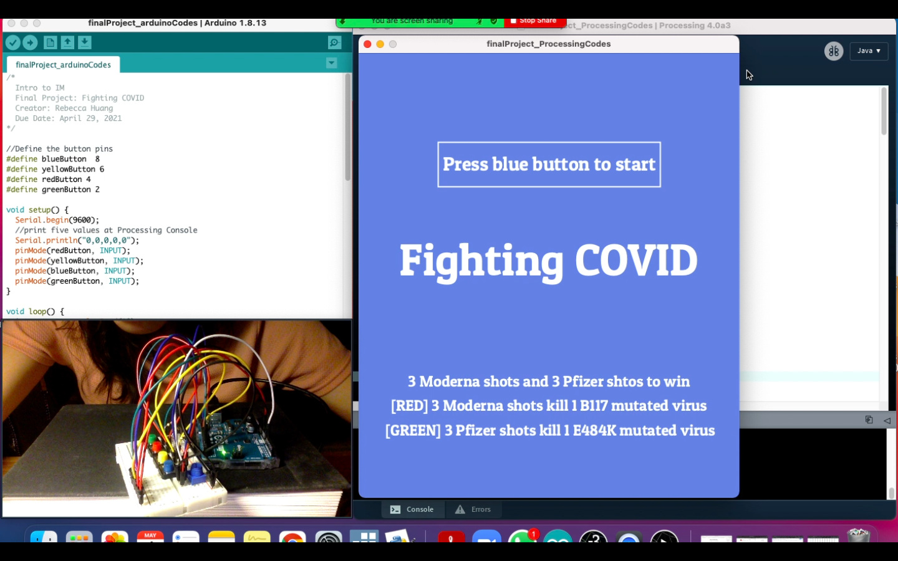](https://www.youtube.com/watch?v=dJJDDZsPyOg)

## Difficulties

### Change of plans 
The biggest challenge that I have first faced while working on this project is "make the right decision in changing the project's idea." This was one of the most devastating periods in creating this project. Initially, I wanted to create a game for which the cell will eject arrows of four colors if buttons with corresponding colors are pressed. Moreover, I wanted to have the cells disappear when arrows with the same color hit them. This whole design based on matching colors had driven me crazy because this design requires sophisticated multilayer codes. Besides, once I discovered an effective approach, I had to apply that in two other scenarios for which makes things more complicated. In short, I have spent hours weighing (1) my ability (2) time left (3) potential problems if stick to the plan, and many more aspects before I proceed with coding. It was an uneasy phase because a wrong decision may lead to more waste of time and even more limited my options on what I can do. 

### Buttons

The buttons have been driving me crazy. First, I got the photometer worked by having it control the x-value of the cell. This successful experience gave me confidence in applying the same logic to the buttons. However, it was not working. I have spent many times dissecting and understanding the connection between ARDUINO and Processing. I scrutinized the mistakes causing Processing to not communicate well with ARDUINO. I have adjusted the program, such as change Serial.print to Serial.println, to see if that made a difference. I guess this difficulty lies in my inefficient way of debugging. I had no procedures and was not spending time understanding the computer's logic. 

At one point, I have successfully made the button work. However, the Processing console is not printing the button's on or off value consistently, meaning it display button is pressed even though I did not touch the buttons. After I seek help from Discord, Professor Shiloh suggested I draw my schematic. In the process of doing so, I noticed that I lacked the connection from 5v (only used pin 8). By fixing the wire, ARDUINO's Serial monitor showed a precise button on and off. While that was good news, the Processing is not working accordingly. I noticed the console had a slight moment of showing "0,0" Whenever that message was printed, the game started itself rather than controlled by the button as I intended. 

Finally, I followed through with my codes with logic, and I discovered that I made a mistake in the Processing code. The if statement: if (string1.equals(string2)) == true), I set string1 equal to the ARDUINO's button on or off message. However, for string2, I again assigned it to ARDUINO's value. I should have not done this because those values will then always be equal, making there no point in checking if the statement is true. After I manually assigned string2 to "redButtonOn", the problem was solved.  

## Credits 
1. Dan's video about arrays. 
2. Dan Shiffman's Frogs video. 
3. Professor's help on making the buttons work by checking the Serial function in Processing. 
4 .Shout out many thanks to Chinonyerem agreed on having a zoom call with me where we were experimenting with the buttons. 
5. Shout out many thanks to Ayush who had zoom calls with me and inspired me on how to resolve bugs about detecting objects, which refined my project. 
