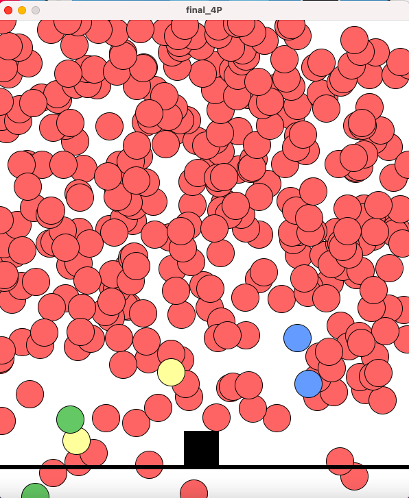
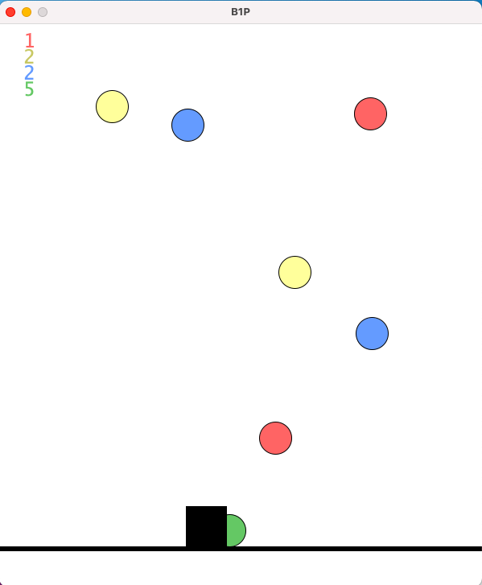

# April 13 Tuesday 

### Final Project Concept
1. Touch potentiometer (ARDUINO) : The cell changes its angle so to aim the virus. sensorValue 0-3 means 1 degree, sensorValue 3-6 means 2 degree, and so on. 
2. Press buttons (ARDUINO) : Create arrow-shape bullets that are ejected from the cell. The color of the bullets depends on the color of the button pressed. 
3. Virus appraoch the cell (PROCESSING) : When game start, virus of colors blue/green/red/yellow appraoche the cell. 
4. Virus and bullet of the same color collides (PROCESSING) : Both disappear. 
5. Virus and bullet of different color collides (PROCESSING) : Virus continue appraoches the cell. 
6. Virus touches the cell (PROCESSING) : cell's diameter -2 
7. How to win ? Cell remains after 100 virus appraoched it. 
8. When is losing ? Cell diameter <= 5 after 100 virus. 
9. >> LED becomes red if the cell is about to die if five more virus hits it. 

<p align="center">
  

### Questions 
1. How to make the virus vanish from the screen whenever it touches the cell? 
2. How to make the bullets and virus both vanish together when they collide? 
3. How to let the cell spit out bullets? 

# April 15 Thursday 
Completed the ARDUINO board and completed the structure of the Processing program, including the void setup and draw, potential classes, and functions for differernt objects. 

# April 16 Friday 
Reviewed array. 

# April 17 Saturday
Completed the basic codes for three objects: the cell, the arrow, and the virus. Able to move the arrow with keyPressed. 

<p align="center">
  
  
<p align="center">
  

### Discoveries
Background(255) should be placed under the draw and not the setup function. Or else, the moving object will display a tail of shade. 

# April 18 Sunday 
Resolved mistakes in the code of making the virus move. 

<p align="center">
  

# April 19 Monday 
1. Applied array and experiment with effectively create different objects.
2. Struggled with making objects under array distinctive. 

### Discoveries 
I understood the number 0,1,and 2 inside values[0], values[1], valued[2], of an array as the labels of the object. Therefore, I thought that I was able to call the objects out by their lables. However, I discovered that it was not the case. For my array of vmany[] that includes many virus. The numbers inside the [] of vmany[]  are the total number of the objects an array contains. 

# April 20 Tuesday 
Dealt with mistakes in Processing codes and experiment with button applications. 

# April 21 Wednesday 
Today, I have seriously considered to change my project idea. While the concept of pressing buttons with the color same as the virus, and kill the virus by having the cell eject an arrow with the corresponding virus's color is interesting, this need of matching colors of different objects enhanced the game's complexity to an extent that I would not be able to generate a minimal viable product on time. Today, I have spent a lot of time weighing the pros and cons of making a huge turn at this point, assessing my abilities, and designing a game that is creative, fun, and possible to produce. 

At the end, I have modified my project to the following version: 

<p align="center">
  

For this version, I decided to have :
1. Potentiometer that controls the x value of the cell to move left and right, to avoid the virus. 
2. Four classes of different virus fall from above.
3. Pressing the buttons will delete the virus one by one. However, if there are no virus of a specific color left and the player is still pressing the button, then the player would be adding a dangerous virus. Or, it may be press buttons to create arrows ejecting from both left and right sides. 
4. if the cell is touched by the virus, then the player lost. 

### Discoveries
1. When the virus fall down from the sky, the number of the virus changes every time even though I had specify having 8 virus in total.
2. I copied and pasted the exact same code to the other Processing file, and then nothing works. I realised that the new codes are incompatibility with the original codes. 


# April 22 Thursday 
### Accomplishments: 
1. Created many virus with the use of array.
2. Created different colours of virus with the use of array. 
3. Made virus approach the cell from all angles.
    1. Applied array and received the following error message: 
        1. ArrayIndexOutOfBoundsException: Index 4 out of bounds for length 4. Could not run the sketch (Target VM failed to initialize). For more information, read revisions.txt and Help → Troubleshooting.
    2. Resolved the problem. 

### Discoveries

Using arraylist may not be the most effective method: 

<p align="center">
  

# April 23 Firday

<p align="center">
  

Finally, I have obtained a minimal viable project. 

### Difficulties
1. Unable to create new objects from the array. After checked out Daniel Shiffman's video on creating the game Frogger https://www.youtube.com/watch?v=giXV6xErw0Y, I was inspired by his method of creating more buses and resovled the problem. 
2. I managed to create score count by calculating the distance between the cell(black box) and the virus(the falling colorful objects). However, the potentiometer's value is not consistent as the program sometimes missed counting scores. I seeked help from classmates and resolved the problem by using boolean touch true or false to minimize the margin of errors. 

### Discoveries
Writing notes that resembles the actual code, while not completely using coding language, has allowed me to carefreely pour out my thoughts. The importance of taking notes and plan before start coding is that I can understand the effects each section create and so decide the approach that can get me to that point with minimal complication, rather than trying things out and see how they are compatible with each other. Following is an example of notes I jotted down when designing how to win the game: 
```
if (score yellow == 3 &&  green ==1) {
score yellow -= 3;
green = green -1; 
}

if (score yellow < 3  && green > 0 ) {
lose the game
} 

if (score red == 3 &&  blue ==1) {
score red -= 3;
blue = blue -1; 
}

if (score red < 3  && blue > 0 ) {
lose the game
} 

if (yellow == 3 && red == 3) {
win the game;}
```

# April 24 Saturday 

1. Eliminated unessesary code from ARDUINO. 
2. Modified the rules for the players to find the game entertaining.
3. Loaded images for the objects. 

# April 25 Sunday 

Spent hours experimenting with button applications. Progress was minimal as had only made ARDUINO printed 2 lines of interger "2" on Processsing's console.

# April 26 Monday 

<p align="center">
  

Finally, I managed to complete the project for which only works such as enhancing aesthetic, commenting codes, and working on documentation are left.

### Attempt the apply buttons rather than mousePressed or keyPressed
I tried to use the red button instead of the Processing functions such as mousePressed or keyPressed as the way to start the game. However, the vaules of the red Button were not reliable as Processing's consoles showed "redOn" even when I did not press the red button. I applied the following codes: 
Codes under the function of serialEvent:
```
    String values[]=split(infoFromA, ',');
    if (values.length==2) {
      xPos = (int)map(int(values[0]), 0, 1023, width-mass, 0);
      values[1] = aValue;
```
Codes under the startGame function: 
```
  if (aValue == "redOn") {
    gameStage = "PLAY";
  }
```
<p align="center">
  

The console displayed "redOn", indicating that I have pressed the red button. However, that was not true, I was not touching the red button.

# April 27 Tuesday 
