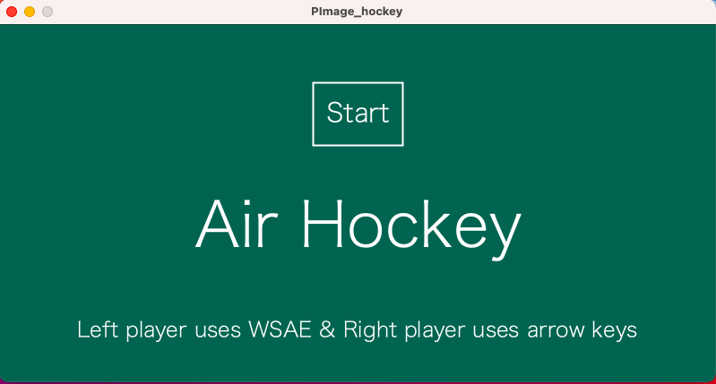
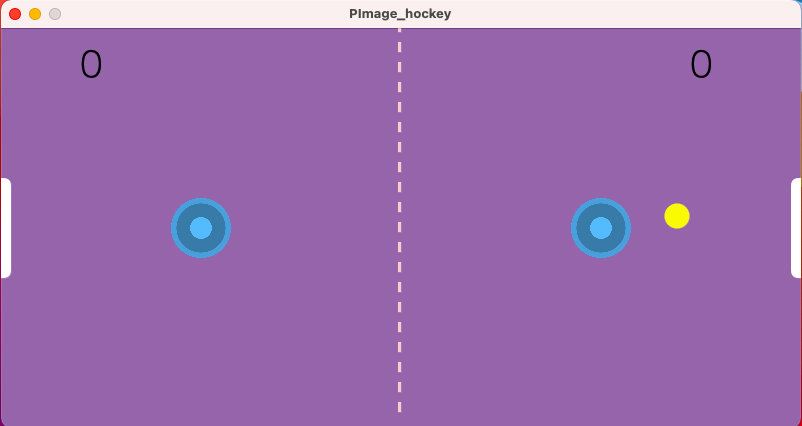
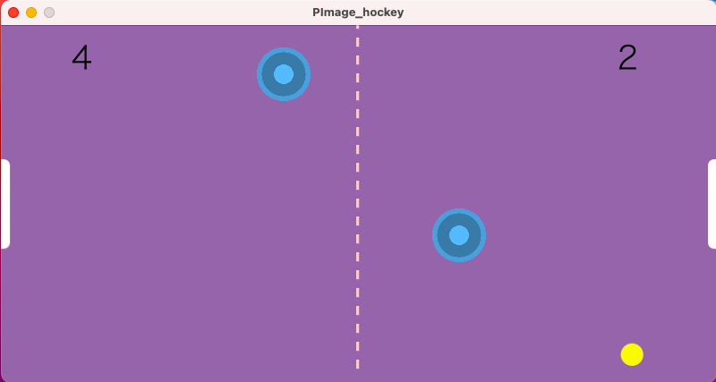
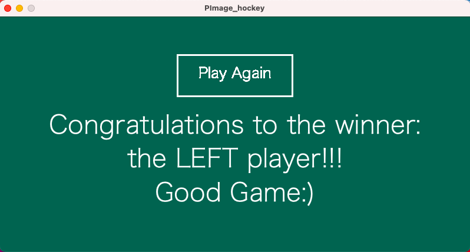

# Midterm Project: Air Hockey

## Description

**Demo**
1. For the .pde files, please view the folder named "theproject" under this midtermProject folder.
2. For the journal of making this midterm proejct, please view "journal.md" inside this midtermProject folder. 

## Game Stages

  

**Start Screen**
This program will take some time to load because it has four sound files. In the start screen, the players will encounter: (1) a green screen displaying the button that invites them to press to start the game; (2) the name of the game "Air Hockey"; (3) the instructions of which players should use which keys. Moreover, the players will hear joyful music. 

  
  
**Play Screen 1**
After the game begins, the players will encounter a puck that immediately starts moving from the table's center. Placing the puck in the middle at first is for the fairness of both players. Then, the right player may control the paddle with arrow keys, and the left player may control the paddle with the keys "wsae/WSAE". The first player who scores a goal of FIVE will win the game.  The scoring goals are the white rectangle bars at each side of the table. When the right player scores the left player's scoring goal, the right player gets one point and vice versa. Also, the player who just scored will not be the first to serve when the puck appears again. For example, if the right player scores, the puck will automatically reset to let the left player serve. Lastly, the puck can move quite fast but will slow down if no one hits it, just like during the real air-hockey game.

  
  
**Play Screen 2**
Towards the end of an intense game, we can see that the left player is about to win. Take note that, while most of the time should be alright, the players may occasionally encounter the puck stuck under the paddles. If that is so, try waiting for a few seconds, and the puck will enter one of the goals. If not so, then the players can start a new game and enjoy playing again. The puck will create sound when colliding with the paddles or hit the edges. Also, there will be a sound of scoring when someone scored. Lastly, the paddles that the players use are the loaded image of the blue paddle.

  
  
**End Screen**
Finally, the game ended, and the left player indeed won. At this point, all players will hear the music of congratulations constantly replaying and see a message of congratulations display on the screen. Lastly, the players may choose to play again by clicking the button play again.  

## Major problems and modification 
This project is hard to begin. It was not clear that I should right away create two classes for one is for the paddles, and the other is for the puck. However, once I get the basic framework done, I was excited to experiment with how different functions may play out. Some program functions are easier to code: import sound, import images, display text and draw shapes. However, the others may get me stuck for hours. 

**void collision() problems** \
This one, in particular, drove me crazy. The final version of this function executes that: if the distance between the puck and either paddle is smaller than their radii's combination, the puck changes its velocity. **My first attempt** was to incorporate the ellipse equation for the paddle into the function in the way that if the puck's x and y values fall under the ellipse's perimeter, the puck collides with the paddle is true. However, that did not work for reasons I was not sure. Nevertheless, I have learned one thing: do not settle with ideas that seem plausible but too complicated. The approach of using the ellipse equation might work (who knows), but the main thing is before I figure out how to link that equation to other objects' (x,y), I would have already spent at least 5 hours. **My second attempt** was to use a boolean of some kind to set a condition of collision being true and false, then use that to say if collision, the puck reflects. This attempt failed because a boolean requires a variable. My ideas were either a range of value or function, which did not allow me to make the boolean work. **My third attempt** was to seek help from Ayush, one of my IM classmates, as I was frustrated and destitute of approaches. We had a zoom call, and he introduced me to the function dist() that allows me to check the distance between puck(x,y) and paddle(x,y). He inspired me to use the statement of if the distance between puck and paddle is smaller than their radii combination, puck reversed velocity. This idea sets the basic logic of how the function collision operates regardless of how I modify it later. 

**void collision() modification** \
I insisted on creating an air hockey game that resembles a real-life scenario. The puck does not bounce off from the paddles with the right angles and may get stuck under the paddle if the paddle moved too fast towards it bothered me. Though the air hockey game can work without modification, I still sought some methods that might be of use. My attempts include: adding acceleration to the puck with PVector, changing the puck's initial speed, changing the puck's reversed speed after a collision, and minimizing distance's miscalculation. However, those methods still had not created the effect I anticipated. Then, I Googled "Air Hockey" on OpenProcessing.org and discovered a Danish programmer's code that helped me out: https://www.openprocessing.org/sketch/975642. I realized that the point I have been missing was: the distance between the puck and paddles should have been a value incorporated in the puck's function of changing velocity. By linking the paddles' movement to the puck, the puck can make more realistic reactions. The new idea led to a big change in the fundamental building block of my project. I initially set the key pressed as calling the paddle to move a certain number of pixels (int). If I wanted to make the puck's speed change according to the paddle's movement, the paddles' should move not based on pixels but speed (float). Therefore, I took the risk to make key pressed means giving the paddles speed. Problems did emerge afterward, but, fortunately, they were minor, and the transformation was successful. 

**Other problems and modifications** \
***keyReleased()*** The right and left players can not simultaneously move their keys. However, keyReleased() solved the problem. 
***constrain()*** This is a useful simple function of Processing that allowed me to limit the object's range of movement. 
***gameStages*** The gameStages can be tricky. What took me a long while to figure out was that I need to reset the game's condition (scores reset to zero) when a new game begins to prevent the endGame screen from constantly concluding that the game should end. 
***playing sounds*** Insert the sounds at the right location and apply the function isPlaying() to detect if the music is playing. If not, then we can call the soundFile.

## Reflection \
I have no idea how the solutions to my problems and modifications were possible had I not have access to helping resources: Discord, classmates, other programmers' codes, Dan Shiffman's videos, Stack Overflow, and many more. I here shout out many thanks to my classmate Ayush. I had in total three zoom calls with him during working on this midterm project. Without his perspectives and coding experience, I might have drowned in the frustration of no way to go and the hopelessness of facing a stack of code but clueless about where went wrong. Programming is a collaborative effort.  An effective learning method is to comment on other people's code and internalizes that into my ability. This process is possible only when people are willing to share their knowledge. Thanks to the open resources and programmers' fresh perspectives. Those insights helped make my air hockey game plays like a real air hockey game. 
