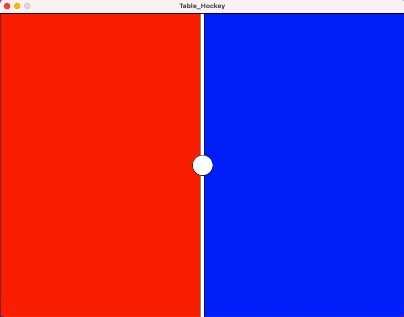

## Midterm Journal 
### What is the midterm project about? 
The midterm project is about creating a 2 players table hockey where the needed elements are: 
(1) strikers/mallets the players will use to hit (2) the puck(the name of the disk being pass back and forth between the players.
The players can choose four 3 types of tournaments, classified by the number of goals needed to win the game: (1) 7 goals; (2) 9 goals; (3) 11 goals.
### Feb 18(Thursday)
Spent a while researching on how to avoid Processing crash in the long term. 
### Feb 19(Friday)
Rather than dive into coding, I first spent some time on reviewing Lecture notes and scrutinizing codes of the art and games done with Processing, because I thought I should get myself more familiar with the Processing functions. Once I have a stronger foundation on familiarizing the overall program structure, I may avoid stuck on daunting debugging. 
### Feb 20(Saturday)
1. Review the map function to see how that may allow me to create strikers.
2. Check out the codes of some games created by others on https://openprocessing.org/curation/25/
3. Discovered the code for game *Catch the Flag* worth learning. 

**Inspiration**
Seeing how the *Catch the Flag* game did not have players use the mouse, I am inspired to have both players using keys to be fair for everyone. Player 1 will use the key "WSAD" as "up, down, left, right", whereas Player 2 will use the actual "up down left right" keys for playing.
### Feb 21(Sunday)
Go through tools that might be of use, such as:
   a) Basic functions such as arrray and for loop.
   b) kepPressed();
### Feb 22(Monday)
Created background for the table hockey game.
````
int fontsize = 80;

void setup() {
  size(800, 600);
  background(135);
  String [] fontList = PFont.list();
  printArray(fontList);

}

void draw() {
  //create left table
  noStroke();
  color leftTable = color(250, 30, 0);
  fill(leftTable);
  rect(0, 0, 400, 600);
  //create right table
  color rightTable = color(0, 30, 250);
  fill(rightTable);
  rect(400, 0, 400, 600);
  //design the hockey table
  fill(color(255));
  rect(395, 0, 8, height);
  fill(color(255));
  circle(width/2, height/2, 40);
}
````


### Feb 23(Tuesday)
Figuring out how to create the start and restart game function, and the following are the incomplete codes:
````
void startgame() {
  boolean start= true;
  if (start == true)
  {
    game();
  }
  if (start == false);
  {
    background(0, 130, 130);
    PFont f = createFont("HanziPenSC-W3", 32);
    textFont(f, fontsize);
    text("Table Hockey", width/2,height/2);
  }
}

void game() {
  
}
````
To do list: 
1. **Start_page**: Continue and complete the "start game" page with choice of tornaments. 
2. **2_Strickers_and_1_puck**: load photos of 2 strikers and one puck. 
3. **Move_the_strikers**: allow the 2 players to move strikers with the keys. 
4. **Puck_reacts**: The puck will bouce to the opposite direction one it touches the strikers. 
5. **Score**: Player gain one point when get the puck fully enter the opposite player's goal. [Use: for loop]
6. **Sound_and_Congrats**: When the player receive one point, create a sounds of celebration and print "Good Job" on the screen.
7. **After_score**: The puck should be placed in the center on the side of the player who just lost a point to serve. 
8. **Line_of_separation**: Create function that make the players unable to enter each other's zone. 
9. **Win_lose_Restart**: Create the "Game Over" and "You win" page.

