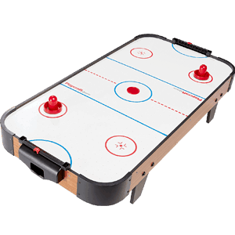
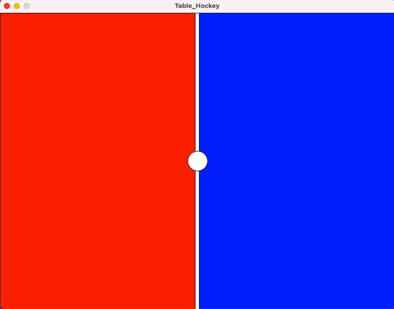
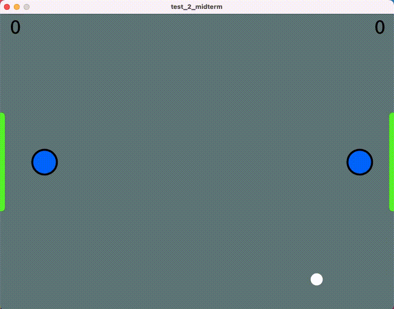
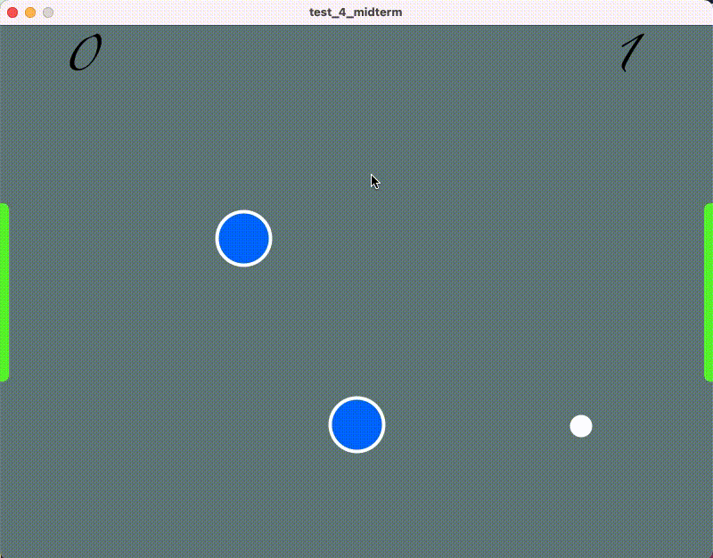

# Midterm Journal 

<p align="center">
  
  
## Air Hockey 
This midterm project is about creating a 2 players air hockey game. In this air hockey game, two players will each position at the edges of the table and receive a paddle for hitting the puck (the disk being pass back and forth between the players). The player who first recevied a score of 9 will be the winner. 
   
## Feb 18 Thursday 
Today, I experienced a Processing crash and I have spent most of my time researching on how to solve it in the long term. 

## Feb 19 Friday 
Today, I reviewed Lecture notes and scrutinized codes of the arts and games done with Processing, for the sake to familarize the Processing functions and develop a stronger coding foundation allowing myself to avoid stuck on daunting debugging. 

## Feb 20 Saturday 
Today, I did the following three tasks:
  1. Reviewed the map function to see how that may allow me to create paddles.
  2. Checked out the codes of some games created by others on https://openprocessing.org/curation/25/
  3. Discovered the code for the game *Catch the Flag* worth learning. 

**Reflection** 
Seeing how the *Catch the Flag* game did not have players use the mouse, I am inspired to have both players using keys to be fair for everyone. Player 1 will use the key "WSAE" as "up, down, left, right", whereas Player 2 will use the actual "up down left right" keys for playing.

## Feb 21 Sunday 
Today, I went through coding concepts that might be of use, such as:  
   1. Basic functions such as arrray and for loop.  
   2. kepPressed();  

## Feb 22 Monday 
<p align="center">
  
  
Today, I created the background.
  
````
int fontsize = 80;

void setup() {
  size(800, 600);
  background(135);
  String [] fontList = PFont.list();
  printArray(fontList);

}

void draw() {
  //create left table
  noStroke();
  color leftTable = color(250, 30, 0);
  fill(leftTable);
  rect(0, 0, 400, 600);
  //create right table
  color rightTable = color(0, 30, 250);
  fill(rightTable);
  rect(400, 0, 400, 600);
  //design the hockey table
  fill(color(255));
  rect(395, 0, 8, height);
  fill(color(255));
  circle(width/2, height/2, 40);
}
````

## Feb 23 Tuesday 
Today, I tried to create the start and restart functions. While incomplete, the following is the progress and experiments. 

````
void startgame() {
  boolean start= true;
  if (start == true)
  {
    game();
  }
  if (start == false);
  {
    background(0, 130, 130);
    PFont f = createFont("HanziPenSC-W3", 32);
    textFont(f, fontsize);
    text("Table Hockey", width/2,height/2);
  }
}

void game() {
  
}
````

## Feb 24 Wednesday 
Today, I did the following three tasks:  
1. Created a class for Paddles.  
2. Created a class for Puck.  
3. Included some functions in the classes that can do the following:  
    1. Display the puck.  
    2. Display the paddles.  
    3. Allow the puck to bounce when hit the upper and lower edges.  
    4. The left player can move the paddle up, down, left, and right by pressing the keys: WSEA.  
    5. The right player can move the paddle up, down, left, and right by pressing the arrow keys: UP,DOWN,LEFT,RIGHT.  

**Reflection** 
I realized that the proportion between xspeed and yspeed is important. For the speed of the puck (xspeed, yspeed), if xspeed is larger than the yspeed, then the puck will slide off the screen before having the chance to bounce up and down in between the screen. 

## Feb 25 Thursday 
Today, I did the following three tasks:  
1. Reviewed more coding concepts that allow me to proceed in creating more sophisticated functions.  
2. Redesigned the background.  
3. Created the functiom that limits the paddles' range of movementlet (making both the left and right paddles unable to cross the middle of the table).  

**Reflection** \
Background(0); should be put under the draw() function, or else, rather than create a puck for bouncing back and forth, we will create multiple pucks overlapping each other.

**What works and what does not work: Limit the paddles' range of movement** \
At first, both paddles could move on all parts of the screen. However, what I want was the left paddle having only the area (0, width/2) and the right paddle haivng (width/2,width). It took me a while to figure out how to make different objects under the same class to acquire different ranges. The following is the progress:

First, I used boolean to determine the left and right paddles:
````
  Paddles(boolean left) { //use boolean 
  //and the following if statement to determined the left or right paddle.
    if (left) {
      x = j;
    } else {
      x = width - j;      
    }
  }
````
Soon, I encounter some difficulties. I need to create a function that limits the movement of the paddles for each only has half of the screen, but I was not sure about how to approach the dilemma. Then, I added the following function under the Paddles(boolean left){} function: 
````
    if (x>width/2) {
      x= x-(width/2)-(j/2);
    }
````
Unfortunately, nothing changed. Later on, I separated two paddles' range for x value with the following code: 
````
  void moveLeftX(float steps) {
    x += steps;
    x = constrain(x, j/2, width/2);
  }  

  void moveRightX(float steps) {
    x += steps;
    x = constrain(x, width/2, width-j/2);
  }  
  ````
  And it works! 

## Feb 26 Friday 

**Gaol for the day:** 
1. Allow the paddles to move at the same time.  
2. The puck bounce off as soon as a paddle touches it.  
3. Score and count the scores.  

***For Goal 2*** \
I tried out the following codes:
````
  void checkPaddleLeft (Paddles p) {
    if (x == p.x) {
      xspeed *= -1;
    }
    if (y == p.y) {
      yspeed *= -1;
    }
  }

  void checkPaddleRight (Paddles p) {
    if (x == p.x) {
      xspeed *= -1;
    }
    if (y == p.y) {
      yspeed *= -1;
    }
  }
  ````
However, that was not effective, so I try to discover some solutions by checking the code of "Bouncy Bubbles" from here: https://processing.org/examples/bouncybubbles.html. Unfortunately, that was not helpful. 

***For Goal 3*** \
Frustrated about unable to achieve Goal 2, I decided to first work on Goal 3: create the score function. The tricky part is to let the score happen only when the puck is at a specific "y" range, and the following code that I first tried did not work:
````
  void edges() {
    if (y<0 || y>height) {
      yspeed *= -1;
    }
    if (x<0 || x>width) {
      xspeed *= -1;
    }
  }
  void checkScore() {
    if (y < height-220 && y > height-180) {
      reset();
      score();
    }
  }
  void score() {
    leftscore++;
    rightscore++;
  }
  ````
  After trying out different methods, the following code finally works! : 
  ````
    void edges() {
    if (y < 0 || y > height) {
      yspeed *= -1;
    }
    if (x < 0 || x > width) {
      xspeed *= -1;
    }
    if (x < 0 && y > height-340 && y < height-260 == true) {
      rightscore++;
      reset();
    }
   if (x > width && y > height-340 && y < height-260 == true) {
      leftscore++;
      reset();
    }
  }
  ````
  However, two problems occurred: 
  1. The left paddle does not work anymore. 
  2. Need to let the puck that resets to the center of the table after someone scored to stop moving in the beginning of a new session until a paddle touches it.

***For Problem 1*** \
I solved it by changing the following code:
````
  } else if (key =='a') {
    left.moveLeftX(-10);
  } 
  if (key == CODED) {
    if (keyCode == UP) {
      right.moveY(-10);
 ````
to the following code:
````
 } else if (key =='a') {
    left.moveLeftX(-10);
  } else if (key == CODED) {
    if (keyCode == UP) {
      right.moveY(-10);
````
***Back to Goal 2*** \
I tried to solve the puck and paddles collide issue by writing a function that checks whether the puck and the paddles overlap with use of the paddles' ellipse, then use boolean to execute that if overlap is true, then puck reverse its direction:
````
float function;
void collide() {
  float firstHalf =((pow(x,2))+(pow(25,2))-0.5);
  float secondHalf =((pow(x,2))+(pow(25,2))-0.5);
  function = firstHalf+secondHalf;
  boolean function = true;
  if (function) {
    xspeed *= -1;
    yspeed *= -1;
  }
}
````
However, I was stuck for 2 hours trying to get the function work. Later on, I gave up on this approach and tried another method(after learning the function "dist"), which works:
````
  void collide(float leftX, float leftY, float rightX, float rightY) {
    boolean bounce = false;
    if (dist(leftX, leftY, xU, yU) < 50) {
      bounce = true;
    }
    if (dist(rightX, rightY, xU, yU) < 50) {
      bounce = true;
    }
    if (bounce) {
      xUspeed *= -1;
      yUspeed *= -1;
    }
  }
  ````

***The Completed Minimal Viable Project:***



***Wrapping up the day*** (1) Achieved Goal2 & Goal3. (2) Will work on Goal1 and Problem2 later on.

## Feb 27 Saturday 

**Goal of the day:** 
1. Should resolve some bugs and change the speed or size of paddle/puck to make the game smoother.  
  a) Change the angle of the puck.  
  b) Allow a harder hit of the paddle leads to acceleration of the puck.  
  c) Allow two keys' press to work at the same time.  
  d) Let the puck exist in the middle of the screen during a new session(game after someone scored).  
2. Refine background and enhance aesthetic. 
3. Create the start and restart function of the game.
4. Add sound. 
5. Winner and Looser. 
6. Choose the level of difficulties. 

***Goal_1_Change Puck's Angle:***
1. Check out the article on Circles Collision: https://processing.org/examples/circlecollision.html
2. Seek help from Discord.

***Goal_3__Game Stages:***

****Step 1:**** Originally, I have two classes: (1) class Paddles{} (2) class Puck{}, for which I call the functions under the classses via the void draw() function. To create the game stages: start, play, end(restart), I decided to replace the void draw function with the playGame() function and included functions signifying the three game stages: startGame(), playGame(), and endGame under the void draw() function. I opened a new sketch to make this change to avoid potential mistakes from the new change ruining the program. However, having both the startGame() and playGame() functions ready, I was wondering which screen will the program display first and I tried the progran. While the program displayed the playGame() function first, it weirdly combined the two functions: the textFont "Opensans" I added under the startGame() function for dispaly the phrase "Tabble Hockey" was used under playGame() as the font for the score count.  

****Step 2:**** A crucial concept is that the startgame() function should appear as the first by defult. The game can be a loop where the endGame link back to the startGame(), but startGame() has to be the first thing the players encounter when they open the sketch. With this in mind, I created the following code: 
````
void draw() {
  boolean start = true;
  if (start) {
    startGame();
  }
  else {
   endGame();
   }
}
````
Plus the following code under the startGame() function:
````
  //display a rectangle that incldes the word Start
  stroke(255);
  strokeWeight(2);
  noFill();
  rectMode(CENTER);
  rect(width/2, height/4, 100, 80);
  if (mouseX > width/2-50 && mouseX < width/2+50
    && mouseY > height/4-40 && mouseY < height/4+40
    && mousePressed == false) {
    playGame();
  }
````
While the startGame() function does work and links to the playScreen, I encountered the problem of **The startScreen will only go away during the 0.2 second of mousePressed.** This was undesirable as I need the startScreen to be constantly removed after the game started. The "if press the start button, then playGame()" is sure needed to bridge the startScreen and playScreen. However, I need a command that makes a clearer transition. So, I discarded "boolean" and used "String" to connect all gaming stages:

````
//[1]Create a global variable
String gameStage;

//[2]Set startScreen as default
void setup() {
  gameStage = "START";

//[3]Change the draw() function
void draw() {
  if (gameStage == "START") {
    startGame();
  } else if (gameStage == "PLAY") {
    playGame();
  } else if (gameStage == "END") {
    endGame();
  }
}

//[4]Change the if statement under startGame() function
  if (mouseX > width/2-50 && mouseX < width/2+50
    && mouseY > height/4-40 && mouseY < height/4+40
    && mousePressed) {
      gameStage = "PLAY";
  }
````
Problem solved!!!

However, when I used the same logic to create the restart function [if (gameStage == "RESTART") { restart();] and the restart() function includes gameStage == "PLAY" just like how the startGame() function did, the program does not permanently enter the playGame mode, as when the mouseReleased, the restartScreen will exist again. The bug is demo in the following: 



After hours of scruitizing my code, seeking help, and playing around mousePressed() to see if there is something wrong about it, I finally removed the bug with two simple lines: 
````
    leftscore = 0;
    rightscore = 0;
````
So, what happened was that when the game ends, either the left or right player was still winning. In that sense, the gameStage automatically enters "RESTART" *again*. Only when the mouse was pressed would the screen enter the playGame mode. Therefore, to erase the scores of left and right players, I should reset their scores. 

**Discoveries:** 
1. For a boolean, only varibales can be assigned to be true or false.
2. A key to debug is go over the codes with crystal clear logic, no assumptions, but a mind of the computer. 

**Wrapping up the day:** Achieved (1) Goal 3 & Goal 5. (2) Will work on other parts later on.

## Feb 28 Sunday
1. Checked out videos about PVector: https://www.youtube.com/watch?v=mWJkvxQXIa8&list=PLRqwX-V7Uu6ZwSmtE13iJBcoI-r4y7iEc
2. Learned *PVector*
3. Learned *.add*
4. Learned *random2D*
5. Learned *map*
6. Added sound

***PVector*** \
Applied PVector to my puck and added acceleration to the puck:
````
class Puck {
  Puck() {
    location = new PVector(width/2, height/2); //set puck's location
    velocity = new PVector(2, 3); //set puck's velocity
    acceleration = new PVector(0.005, 0); //set puck's acceleration
  }
  void update() {
    location.add(velocity); //add velocity to puck's location
    velocity.add(acceleration); //add acceleration to puck's location
  }
````
While the added acceleration made the puck's movement matches the physic's laws more, the puck was still not bouncing off from the paddles with the correct angles.

***PVector*** \
Searched for the following for sounds online and applied each to the game phases of (1) puck collision (2) someone scored (3) endGame (4) startGame.
````
SoundFile hockey;
SoundFile score;
SoundFile congratulations;
SoundFile kidding;
````
## March 1 Monday
Game is mostly complete, with some bugs waiting for solutions.

## March 2 Tuesday 
During class:
1. Solved the problem of the startGame music can not stop even when game started with the function isPlaying(), detecting if the song is playing and linked the result to further actions with true/false statements. 
2. Discussed how to adjust the angles of the puck to be more realistic. 

## March 3 Wednesday
Today, I did the following:
1. Reviewed codes.
2. Optimized the program. 
